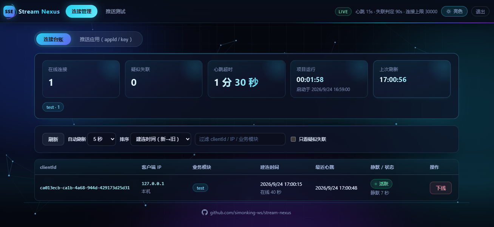
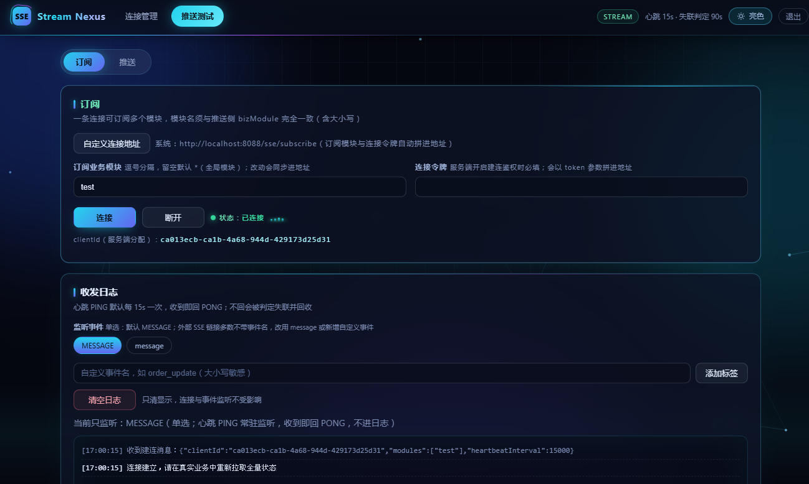
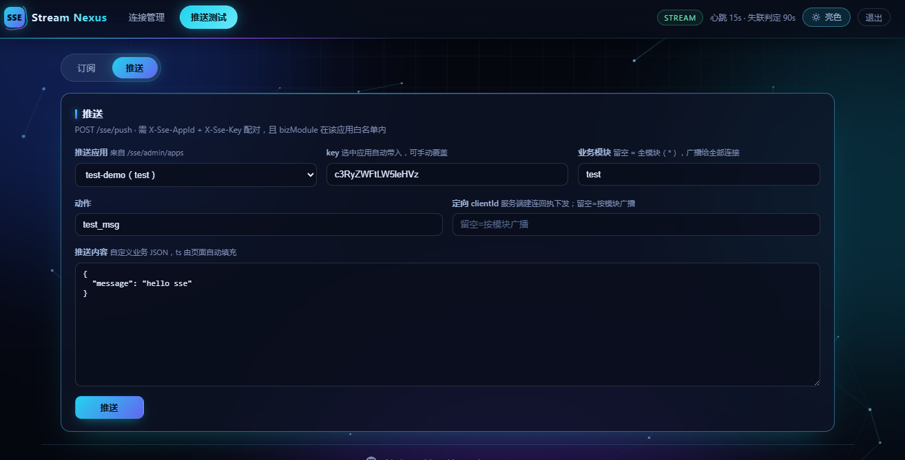

<p align="center">
  
</p>

<h1 align="center">Stream-Nexus</h1>

<p align="center">
一个<strong>轻量级实时推送服务</strong>集合：服务端负责连接管理、按业务模块路由与消息扇出，业务系统只管把消息灌进来。
</p>

<p align="center">
零中间件依赖（无 Redis / MQ / 数据库），全内存运行，独立部署，与业务进程解耦。
</p>

---

| 通道 | 模块 | 终端接入 | 业务系统接入 | 端口 |
| --- | --- | --- | --- | --- |
| SSE | `nexus-sse` | 原生 `EventSource` | HTTP `POST /sse/push` | 8088 |
| WebSocket | `nexus-websocket` | 原生 `WebSocket` | HTTP `POST /ws/push` / TCP 长连接 | 9090 / 8089 / 9091 |

- **技术栈**：Spring Boot 4.1.1 / Java 17 / Spring MVC（`spring-boot-starter-webmvc`）+ Netty 4.2
- **模块**：`nexus-common`（跨模块契约）+ `nexus-sse`（SSE 推送服务）+ `nexus-websocket`（WebSocket 推送服务）+ `nexus-client`（独立客户端 SDK）
- **详细文档**：[SSE 使用说明](docs/SSE使用说明.md) · [WebSocket 使用说明](docs/WebSocket使用说明.md)
- **客户端 SDK**：[SDK 接入说明](docs/SDK接入说明.md)

---

## 主要功能

| 功能 | 说明 |
| --- | --- |
| 长连接订阅 | SSE `GET /sse/subscribe`、WebSocket `ws://host:9090/ws?modules=xxx`；连接永不过期，一条连接可同时订阅多个业务模块 |
| 双寻址推送 | 按 `bizModule` 广播、按 `clientId` 定向，两者可同时使用（命中并集、按连接去重） |
| 全局模块 `*` | 订阅侧默认值；推 `*` = 广播给全部在线连接；推其它模块时订阅 `*` 的连接同样会收到 |
| 全局跨域 | `WebMvcConfigurer#addCorsMappings` 注册 `/**`，源 / 方法 / 头 / 凭证全量放行，无需配置 |
| 心跳保活 | 服务端每 15s 下发 `PING`，客户端回 `PONG`，压制 LB / NAT 空闲断链 |
| 死连接回收 | 四条判据（回调 / 心跳超时 / 软重置 / 写入失败）统一回收，避免半开连接堆积 |
| 推送鉴权 | `X-Sse-AppId` + `X-Sse-Key` / `X-Ws-AppId` + `X-Ws-Key` 配对校验，并按应用限制模块白名单 |
| 运维接口 | 在线连接查询与强制下线；推送应用 `appId`/`key` 的运行时增删（SSE 落盘，WebSocket 仅内存） |
| 内置页面 | `/admin` 连接台账 + 应用管理，`/console` 推送测试页 |
| 管理页登录 | SSE 的 `/admin`、`/console` 与 `/sse/admin/**` 需 session 登录，默认账号 `admin` / `adminsse`；WebSocket 管理页当前开放，生产环境建议限制内网访问 |

---

## 设计优势

1. **零中间件**：连接表与消息 ID 全在内存，不需要 Redis / MQ，单机 `java -jar` 即可跑，接入成本极低。
2. **双通道互补**：SSE 走 HTTP 生态、单向、浏览器原生自动重连；WebSocket 走全双工、可上行、适合高频交互。两套协议与端口完全独立，按终端类型各取所需，可同时部署。
3. **Netty 与 Spring MVC 同进程共享注册表**：`nexus-websocket` 一个进程内，Netty（9090 收终端 / 9091 收业务系统）与 Spring MVC（8089 收 REST 推送）共享同一张连接注册表，REST / TCP 收到消息后直接写 WebSocket 通道，**零跨进程转发、零网络跳转**。
4. **双推送入口**：REST 短连接一次 POST 同步拿回执（`total / success / failed`，推没推到人当场知道）；TCP 长连接一条连接一直推，省掉高频场景反复重建 HTTP 连接与重复鉴权的开销，还自带心跳提前发现链路中断。
5. **永不过期 + 主动探测**：SSE 通过 `SseEmitter(0L)` 与 `async.request-timeout=0` 一并关掉容器超时，WebSocket 用 Netty 读写空闲检测；两者都用**应用级 PING/PONG 一问一答**（浏览器 `WebSocket` 对象看不到协议层 ping/pong 帧，只能走业务帧），解决 TCP 半开连接下 `send()` 仍返回成功、死连接几小时都发现不了的难题。
6. **统一回收入口**：两个服务各有一张连接表，所有回收路径只走各自的注册表 `remove()`，保证连接主表与模块倒排索引一致，杜绝索引泄漏与内存缓慢增长。
7. **极简消息体**：`NexusMessage` 固定 6 个字段，SSE 与 WebSocket 共用同一份定义。协议层字段用枚举保证稳定，业务层字段（`bizModule` / `action`）用字符串，业务方新增维度无需改公共包、无需改枚举。
8. **契约与实现分离**：`nexus-common` 只放契约（消息体、枚举、常量、推送入参出参），SSE 服务、WebSocket 服务与 `nexus-client` SDK 复用同一份，协议漂移风险归零；业务系统可只依赖它，不必引入服务端实现。
9. **精细的推送鉴权**：`AppId` 定位应用、`Key` 证明身份，二者必须配对；每个应用可配 `allowed-modules` 白名单，越权推其他模块返回 403。
10. **连接复用**：一条长连接可订阅多个 `bizModule`，规避浏览器同域 HTTP/1.1 的 6 连接上限。

---

## 快速开始

### 环境要求

- JDK 17+
- Maven 3.8+（或直接使用仓库自带的 `mvnw` / `mvnw.cmd`）

### 构建与启动

```bash
# 编译打包（跳过测试）
mvn clean package -DskipTests

# 启动 SSE 服务
mvn -pl nexus-sse -am spring-boot:run

# 启动 WebSocket 服务（另一个终端）
mvn -pl nexus-websocket -am spring-boot:run
```

Windows 下把 `mvn` 换成 `mvnw.cmd` 即可；也可直接运行 jar：

```bash
java -jar nexus-sse/target/nexus-sse-1.0.0.jar
java -jar nexus-websocket/target/nexus-websocket-1.0.0.jar
```

> 两个服务各占一个端口、各一张连接注册表、各一张推送应用表，完全独立，可同时部署。

### Docker 部署示例

两个模块各带 `Dockerfile` 与 `docker-compose.yml`，在**模块目录**下执行即可一键起服务。

**SSE 服务**（只需映射 8088）：

```bash
cd nexus-sse
docker compose up -d --build     # 构建并启动
docker compose logs -f           # 看日志
docker compose down              # 停掉
```

编排要点（节选自 `nexus-sse/docker-compose.yml`）：

```yaml
services:
  stream-nexus:
    build:
      context: ..                    # 构建上下文必须是仓库根目录
      dockerfile: nexus-sse/Dockerfile
    image: simonking/stream-nexus:1.0.0
    container_name: stream-nexus
    restart: unless-stopped
    ports:
      - "8088:8088"
    environment:
      TZ: Asia/Shanghai
      NEXUS_SSE_HEARTBEAT_INTERVAL: 15s
      NEXUS_SSE_HEARTBEAT_TIMEOUT: 90s
      NEXUS_SSE_MAX_CONNECTIONS: 30000
      NEXUS_SSE_CONNECT_AUTH_ENABLED: "false"
```

**WebSocket 服务**（8089 / 9090 / 9091 三个端口都要映射）：

```bash
cd nexus-websocket
docker compose up -d --build
```

```yaml
services:
  nexus-websocket:
    build:
      context: ..
      dockerfile: nexus-websocket/Dockerfile
    image: simonking/nexus-websocket:1.0.0
    container_name: nexus-websocket
    restart: unless-stopped
    ports:
      - "8089:8089"      # HTTP：管理页 / REST 推送入口
      - "9090:9090"      # Netty WebSocket：终端长连接
      - "9091:9091"      # Netty TCP：业务系统长连接
    environment:
      TZ: Asia/Shanghai
      SERVER_PORT: 8089
      NEXUS_WS_WS_PORT: 9090
      NEXUS_WS_TCP_PORT: 9091
      NEXUS_WS_HEARTBEAT_INTERVAL: 15s
      NEXUS_WS_HEARTBEAT_TIMEOUT: 90s
      NEXUS_WS_AUTH_ENABLED: "true"
```

也可以先打镜像再单跑：

```bash
cd nexus-sse
./scripts/docker-build.sh                     # Windows: scripts\docker-build.cmd
docker run -d --name stream-nexus -p 8088:8088 simonking/stream-nexus:1.0.0

cd ../nexus-websocket
./scripts/docker-build.sh
docker run -d --name nexus-websocket -p 8089:8089 -p 9090:9090 -p 9091:9091 \
  simonking/nexus-websocket:1.0.0
```

要点：

- **构建上下文是仓库根目录**：两个模块的父 POM 在根目录且都依赖 `nexus-common`，所以编排里是 `context: ..` + `dockerfile: nexus-xxx/Dockerfile`；**不要在模块目录下直接 `docker build .`**。
- **多阶段构建**：Maven 镜像负责打包，JRE 镜像只跑运行时，最终镜像不含 Maven 与源码；非 root（uid 1000）+ `exec java` 保证 1 号进程能收到 SIGTERM 优雅停机。
- **配置一律用环境变量覆盖**（Spring 宽松绑定）：`nexus.sse.heartbeat-interval` → `NEXUS_SSE_HEARTBEAT_INTERVAL`，`nexus.ws.tcp-port` → `NEXUS_WS_TCP_PORT`。
- **反向代理**：SSE 必须关掉 `proxy_buffering`；WebSocket 必须带上 `Upgrade` / `Connection` 头且 `proxy_read_timeout` 大于心跳间隔；9091 是裸 TCP（非 HTTP），反向代理无法按路径转发，需四层转发（`stream` 模块）或直连。
- 编排里的令牌是明文示例，生产请用 docker secret / 外部 env 文件挂载；改版本号时同步 `Dockerfile` 的 `ARG JAR_VERSION`。

### 效果示例

SSE 通道（`nexus-sse`，端口 8088）开箱自带两个页面，冒烟验证时看到的就是下面这些界面：

<p>
  
  
  
</p>

WebSocket 通道（`nexus-websocket`，端口 8089）示例正在优化中...

### 一键冒烟验证

1. 打开 SSE 测试页 `http://localhost:8088/console`，点击「连接」→ 状态变为「已连接」。
2. 保持默认订阅模块 `test`，点「推送」→ 命中 `total=1`，页面收到 `test:bid` 消息。
3. 打开 WebSocket 测试页 `http://localhost:8089/console`，同样点击「连接」并「推送」。
4. 观察日志每 15s 收到一次 `PING`，客户端回 `PONG`。

更详细的接口说明、配置项、部署方式、浏览器接入示例，请查看：

- [SSE 使用说明](docs/SSE使用说明.md)
- [WebSocket 使用说明](docs/WebSocket使用说明.md)
- [`nexus-client` SDK 接入说明](docs/SDK接入说明.md)
